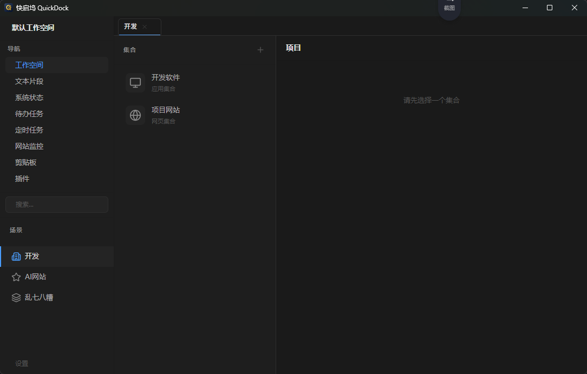

# 快启坞 QuickDock

> 面向 Windows 开发者的效率工具 —— 资源集合、快速启动与工作空间管理

快启坞（QuickDock）是一款专为 Windows 开发者打造的桌面效率工具，融合了 **Raycast 的快速启动** 和 **VS Code 的开发者体验**。它帮助你统一管理项目、目录、网页链接、常用命令和应用，搭配 AI 助手、剪贴板历史、代码片段、命令面板和丰富的内置插件，让开发工作流更高效。



---

## 目录

- [快启坞 QuickDock](#快启坞-quickdock)
  - [目录](#目录)
  - [功能特性](#功能特性)
    - [📦 工作空间与资源管理](#-工作空间与资源管理)
    - [🤖 AI 助手](#-ai-助手)
    - [📋 剪贴板历史](#-剪贴板历史)
    - [🔍 命令面板](#-命令面板)
    - [📝 文本片段（Snippets）](#-文本片段snippets)
    - [✅ 待办任务（Todos）](#-待办任务todos)
    - [⏰ 定时任务（Scheduler）](#-定时任务scheduler)
    - [📡 网站监控（Monitor）](#-网站监控monitor)
    - [🗒️ 快捷笔记](#️-快捷笔记)
    - [📊 系统状态](#-系统状态)
    - [🔌 插件系统](#-插件系统)
    - [☁️ WebDAV 云同步](#️-webdav-云同步)
    - [📸 快照备份](#-快照备份)
    - [🔧 全局热键（可自定义）](#-全局热键可自定义)
    - [🖥️ 系统命令](#️-系统命令)
  - [快速开始](#快速开始)
    - [系统要求](#系统要求)
    - [下载安装](#下载安装)
    - [首次使用](#首次使用)
  - [开发指南](#开发指南)
    - [前置条件](#前置条件)
    - [常用命令](#常用命令)
    - [数据库](#数据库)
  - [技术栈](#技术栈)
    - [后端](#后端)
    - [前端](#前端)
  - [项目结构](#项目结构)
  - [数据模型](#数据模型)
  - [全局热键](#全局热键)
  - [设计哲学](#设计哲学)
  - [内置插件](#内置插件)
  - [第三方插件开发](#第三方插件开发)
    - [插件目录结构](#插件目录结构)
    - [plugin.json 完整字段](#pluginjson-完整字段)
    - [三种运行时](#三种运行时)
    - [标准 UI 样式（common.css）](#标准-ui-样式commoncss)
    - [前端通信协议（postMessage）](#前端通信协议postmessage)
    - [安装与测试](#安装与测试)
    - [分发与发布](#分发与发布)
  - [插件架构参考](#插件架构参考)
    - [核心源码文件](#核心源码文件)
    - [生命周期](#生命周期)
  - [构建与打包](#构建与打包)
    - [本地构建](#本地构建)
    - [平台支持](#平台支持)
  - [架构亮点](#架构亮点)
  - [许可协议](#许可协议)
  - [致谢](#致谢)

---

## 功能特性

### 📦 工作空间与资源管理

- **工作空间（Workspace）** — 顶级容器，隔离不同项目上下文
- **场景（Scene）** — 工作空间下的视图分组，快速切换关注点，支持标签/图标/颜色
- **集合（Collection）** — 资源的逻辑分组，可按项目或类型归类，支持四种打开策略
- **项目（Item）** — 支持 6 种类型：
  - `directory` — 目录，用系统/终端打开
  - `file` — 文件，用系统默认程序打开
  - `url` — 网页链接，用浏览器打开
  - `command` — 终端命令，在终端中执行
  - `app` — 应用程序路径
  - `quicklink` — 快速链接，带参数的快捷方式

全层级支持拖拽排序、FTS5 全文搜索。

### 🤖 AI 助手

- **多配置档案** — 支持 OpenAI / DeepSeek / Kimi / 通义千问 / Ollama / Azure OpenAI / 自定义兼容接口
- **四种对话模式** — 聊天 / 解释代码 / 翻译 / 总结，模式 prompt 可叠加自定义 System Prompt
- **SSE 流式输出** — 本地 HTTP 流式服务（127.0.0.1:随机端口），token 到达即显示，非传统轮询
- **思考过程折叠** — 模型思考内容（reasoning_content）以 `<details>` 折叠展示，默认收起
- **思考模式开关** — 可在设置页开启/关闭思考过程显示
- **Markdown 渲染** — 使用 `marked` + `DOMPurify` 安全渲染 AI 回复
- **参数可配** — Temperature / MaxTokens / TopP / FrequencyPenalty / PresencePenalty
- **自定义 System Prompt** — 设置页 textarea，非空时覆盖默认模式提示
- **会话管理** — 多会话 / 标题自动生成 / 重新生成标题 / 清空上下文 / 删除会话
- **Token 用量统计** — 每次对话自动记录 prompt 和 completion token 数，会话列表可见
- **摘要压缩** — 长对话自动压缩历史摘要（3000 token 阈值），保留最近 12 条完整消息
- **API Key 安全存储** — Windows 下 DPAPI 加密，前端不接触密文
- **测试连接** — 一键验证 API Key 和模型是否可用

### 📋 剪贴板历史

- 自动监听并记录文本、图片、文件剪贴板内容
- 支持固定、搜索、复制粘贴、批量删除
- 过期自动清理（可配保留天数）
- 浮动窗口，失焦自动隐藏，`` Ctrl+` `` 一键唤出

### 🔍 命令面板

- 全局搜索：工作空间 / 场景 / 集合 / 项目统一搜索
- 快速执行：选中即操作，支持键盘导航、多选批量
- FTS5 全文搜索，URL 智能识别存为项目
- 最近使用 / 最常使用列表
- 浮动窗口，`Ctrl+K` 即时唤出

### 📝 文本片段（Snippets）

- 预定义的常用文本模板，关键词 + 内容 + 分类
- 一键复制或粘贴到当前活动窗口
- 支持 `{date}` / `{time}` / `{username}` / `{clipboard}` 变量替换
- 搜索、快捷笔记自动保存

### ✅ 待办任务（Todos）

- 待办列表 + 看板视图（待办 / 进行中 / 已完成三列）
- 子任务（单层级 checklist）、标签分类
- 重复待办（每日 / 每周 / 每月）、到期定时提醒（系统通知）

### ⏰ 定时任务（Scheduler）

- 五种动作类型：打开软件 / 目录 / 网页 / 命令 / HTTP 请求
- 五种调度方式：一次性 / 间隔 / 每天 / 每周 / 每月
- 执行后系统通知，支持手动立即执行

### 📡 网站监控（Monitor）

- 定时探测 HTTP 状态码与响应时间（GET / HEAD / POST）
- SSL 证书到期预警（可自定义提前天数）
- 关键字 / 正则内容匹配检测
- 在线率统计、检测日志、状态翻转通知（桌面 + 钉钉 / 企微 / 飞书）
- 响应时间趋势图（24h / 7d / 全部）

### 🗒️ 快捷笔记

- 浮动笔记窗口，`Ctrl+Shift+N` 即时唤出
- 自动保存（500ms 防抖），存为文本片段
- 失焦自动隐藏

### 📊 系统状态

- CPU / 内存 / 磁盘 / 进程数 / IP 实时概览
- 下行 / 上行实时网速监测
- 每 3 秒自动刷新

### 🔌 插件系统

- 19 个开箱即用的内置插件（计算表格、JSON2TS、JWT 解码、正则提取、Markdown 预览……）
- 支持三种运行时：纯前端（none）、内嵌 JS 引擎（goja）、独立子进程（native）
- 基于 JSON-RPC 2.0 的前端 ↔ 后端通信协议
- 支持运行时安装 / 卸载 / 启用 / 禁用 / 热键绑定
- [开放第三方插件开发](#第三方插件开发)，打包为 ZIP 即可分发

### ☁️ WebDAV 云同步

- 全量 JSON 备份 / 恢复
- 多版本管理
- 任意 WebDAV 服务器（自建 / 第三方）

### 📸 快照备份

- 一键导出全部数据为 JSON 文件
- 导入恢复，迁移无忧

### 🔧 全局热键（可自定义）

- 所有热键均可在设置页面自定义
- 运行时动态重注册
- 捕获新热键时自动暂停全局监听以避免冲突

### 🖥️ 系统命令

- 锁屏、关机、重启、睡眠、清空回收站

---

## 快速开始

### 系统要求

- **操作系统**：Windows 10 1809+ 或 Windows 11
- **运行时**：WebView2 Runtime（Windows 自动带）
- **磁盘**：~100MB

### 下载安装

1. 从 [Releases](https://github.com/parieses/quickdock/releases) 下载最新版本
2. 解压到任意目录（推荐 `%LOCALAPPDATA%\QuickDock`）
3. 运行 `QuickDock.exe`
4. 任务栏托盘出现 QuickDock 图标即启动成功

### 首次使用

启动后按 `Ctrl+Space` 唤出主窗口，跟随引导页完成初始设置即可开始使用。

---

## 开发指南

### 前置条件

- Go 1.25+
- Node.js 22+
- Wails3 CLI

```bash
# 安装 Wails3 CLI
go install github.com/wailsapp/wails/v3/cmd/wails3@latest

# 安装前端依赖
cd frontend && npm install
```

### 常用命令

| 命令 | 说明 |
|------|------|
| `wails3 dev` | 开发模式（前后端热重载） |
| `go build -o quickdock.exe .` | 直接 Go 构建（需先 `npm run build`） |
| `wails3 build` | 生产构建（含前端构建 + 绑定生成） |
| `task build` | 通过 Taskfile 构建 |
| `task run` | 直接运行已构建的应用 |

**注意**：裸 `go build`（无 `-tags production`）会落入 dev 单实例锁，与正式版冲突。正式发布须走 `wails3 build`（自动加 production tag）。

### 数据库

- SQLite 数据库文件：`~/.quickdock/quickdock.db`（WAL + 外键 + 5s busy timeout）
- 剪贴板图片：`~/.quickdock/images/`
- 应用配置：`%APPDATA%/QuickDock/`

---

## 技术栈

### 后端

| 技术 | 说明 |
|------|------|
| **Go 1.25** | 主语言 |
| **Wails3 v3.0.0-alpha2** | 桌面应用框架 |
| **modernc.org/sqlite** | 纯 Go SQLite（无 CGO） |
| **golang.org/x/sys** | Windows 系统 API 调用 |
| **dop251/goja** | JavaScript 沙箱（插件执行） |
| **google/uuid** | UUID 生成 |
| **DPAPI** | Windows 数据保护 API（API Key 加密） |

### 前端

| 技术 | 说明 |
|------|------|
| **Vue 3 + TypeScript** | UI 框架 |
| **Vite 6** | 构建工具 |
| **Pinia 3** | 状态管理 |
| **vue-i18n** | 国际化（简体中文 / English） |
| **Lucide Vue** | 图标库 |
| **pinyin-pro** | 拼音搜索支持 |
| **marked + DOMPurify** | Markdown 安全渲染（AI 回复） |
| **@wailsio/runtime** | Wails 前端运行时绑定 |

---

## 项目结构

```
quickdock/
├── main.go              # 入口：三窗口创建 + 应用配置
├── main_common.go       # 跨平台通用入口逻辑
├── main_windows.go      # Windows 专属入口（单实例锁等）
├── dragdrop.go          # 拖放支持
├── services/            # Wails 服务层（199+ 前端绑定方法）
│   ├── service.go       # AppService 核心
│   ├── lifecycle.go     # 生命周期管理
│   ├── workspace.go     # 工作空间 CRUD
│   ├── scene.go         # 场景 CRUD
│   ├── collection.go    # 集合 CRUD
│   ├── item.go          # 项目 CRUD
│   ├── clipboard.go     # 剪贴板历史
│   ├── clipboard_sys.go # 系统剪贴板操作
│   ├── palette.go       # 命令面板搜索
│   ├── snippet.go       # 文本片段
│   ├── todo.go          # 待办任务
│   ├── schedule.go      # 定时任务
│   ├── schedule_runner.go # 定时任务调度引擎
│   ├── monitor.go       # 网站监控
│   ├── monitor_checker.go # 监控探测引擎
│   ├── system.go        # 系统状态与命令
│   ├── hotkey.go        # 热键配置管理
│   ├── plugin.go        # 插件管理
│   ├── snapshot.go      # 快照备份
│   ├── webdav.go        # WebDAV 同步
│   ├── app_launcher.go  # 应用启动
│   ├── frecency.go      # 频率排序算法
│   ├── tool.go          # 打开工具管理
│   ├── autostart.go     # 开机自启
│   ├── api_result.go    # 统一 API 返回
│   ├── types.go         # 配置类型定义
│   ├── ai.go            # AI 对话核心（streamAIChat / callAIOnce / buildAIMessages）
│   ├── ai_stream.go     # AI 本地 HTTP SSE 流式服务
│   └── update.go        # 软件更新检查与下载
├── internal/
│   ├── db/              # SQLite 数据层
│   │   ├── db.go        # Database 封装 + 安全白名单
│   │   ├── schema.go    # 表结构 + 自动迁移
│   │   ├── ai.go        # ai_conversations / ai_messages CRUD
│   │   ├── workspace.go # 工作空间数据层
│   │   ├── scene.go     # 场景数据层
│   │   ├── collection.go# 集合数据层
│   │   ├── item.go      # 项目数据层
│   │   ├── clipboard.go # 剪贴板数据层
│   │   ├── snippet.go   # 文本片段数据层
│   │   ├── todo.go      # 待办数据层
│   │   ├── schedule.go  # 定时任务数据层
│   │   ├── monitor.go   # 监控数据层
│   │   ├── tool.go      # 打开工具数据层
│   │   ├── settings.go  # 设置数据层
│   │   ├── snapshot.go  # 快照数据层
│   │   ├── repository.go# 仓库层
│   │   └── helpers.go   # 辅助函数
│   ├── platform/        # 平台 API 封装
│   │   ├── crypto_windows.go # DPAPI 加密（API Key）
│   │   ├── clipboard.go # 剪贴板读写
│   │   ├── commands.go  # 系统命令
│   │   ├── monitor.go   # 多显示器定位
│   │   ├── sysinfo.go   # 系统信息
│   │   ├── netstats.go  # 网络速度采样
│   │   └── icon.go      # 图标处理
│   ├── plugin/          # 插件管理器
│   └── webdav/          # WebDAV HTTP 客户端
├── frontend/
│   ├── src/
│   │   ├── components/  # 24 个 Vue 组件
│   │   │   ├── AIPage.vue         # AI 对话页面
│   │   │   ├── TodoPage.vue       # 待办任务页面
│   │   │   ├── SchedulePage.vue   # 定时任务页面
│   │   │   ├── MonitorPage.vue    # 网站监控页面
│   │   │   ├── SystemStatusPage.vue # 系统状态页面
│   │   │   ├── NotePanel.vue      # 快捷笔记面板
│   │   │   ├── PluginManagerPage.vue # 插件管理页面
│   │   │   └── ...（更多组件）
│   │   ├── stores/      # Pinia 状态管理
│   │   ├── types/       # TypeScript 类型（含 ai.ts）
│   │   ├── utils/       # 工具函数
│   │   ├── i18n/        # 国际化（zh-CN / en-US）
│   │   └── composables/ # 组合式函数
│   └── vite.config.ts
├── plugins/builtin/     # 19 个内置插件
├── plugins/templates/   # 插件开发模板（none / goja / native）
├── build/               # 构建配置
├── docs/                # 设计文档
├── DESIGN.md            # 设计系统规范
├── Taskfile.yml         # 构建任务定义
└── go.mod
```

---

## 数据模型

```
Workspace（工作空间）
  └── Scene（场景）— 标签/类型/图标/颜色
       └── Collection（集合）— 类型/打开策略/关联工具
            └── Item（项目）
                  ├── directory   — 目录
                  ├── file        — 文件
                  ├── url         — 网页链接
                  ├── command     — 终端命令
                  ├── app         — 应用程序
                  └── quicklink   — 快速链接
```

**独立模型：**

| 模型 | 说明 |
|------|------|
| **ClipboardEntry** | 剪贴板条目（文本/图片/文件） |
| **Snippet** | 文本片段 |
| **Todo** | 待办任务（子任务、标签、状态、重复） |
| **Schedule** | 定时任务（五种调度、五种动作） |
| **Monitor** | 网站监控（状态码/SSL/内容匹配） |
| **AIConversation** | AI 对话会话（标题、摘要、token 统计） |
| **AIMessage** | AI 消息（角色、内容、思考过程） |

所有数据库表通过白名单机制防止 SQL 注入。

---

## 全局热键

| 功能 | 默认快捷键 | 说明 |
|------|-----------|------|
| 切换主窗口 | `Ctrl+Space` | 显示 / 隐藏主界面 |
| 剪贴板历史 | `` Ctrl+` ``（反引号） | 显示 / 隐藏剪贴板浮动窗口 |
| 命令面板 | `Ctrl+K` | 显示 / 隐藏命令面板浮动窗口 |
| 快捷笔记 | `Ctrl+Shift+N` | 显示 / 隐藏笔记浮动窗口 |

> 所有热键均可在「设置 > 热键」页面自定义。

---

## 设计哲学

快启坞遵循 **精准暗色极简主义（Precision Dark Minimalism）**：

- **暗色主题为主** — 层次化灰色调，非纯黑，通过明度对比创造深度
- **强调色 `#4a9eff`** — 仅用于功能性交互元素，不作装饰
- **三面板布局** — 侧边栏(210px) | 集合列表(300px) | 项目列表(flex-1)
- **8px 基准间距** — 4px 递增，从 2px 到 48px
- **系统字体栈** — 无自定义字体，基字大小 13px
- **150ms 过渡** — 少动效，仅状态变化时使用动画
- **键盘优先** — 所有交互均支持键鼠操作
- **Shadow-border 技术** — `box-shadow` 替代 CSS `border`，消除布局偏移
- **4 种色调层次** — `bg-primary(#1a1a1a)` → `bg-secondary(#1e1e1e)` → `bg-tertiary(#242424)` → `bg-active(#2a2a2a)`

详细设计规范请参阅 [DESIGN.md](./DESIGN.md)。

---

## 内置插件

QuickDock 内置 19 个即开即用的开发小工具：

| 插件 | 功能 |
|------|------|
| `calcsheet` | 计算表格 |
| `case-converter` | 大小写转换 |
| `code-formatter` | 代码格式化 |
| `cron-explainer` | Cron 表达式解析 |
| `data-converter` | 数据格式转换 |
| `emoji-search` | Emoji 搜索 |
| `file-compare` | 文件对比 |
| `hosts-manager` | Hosts 文件管理 |
| `http-status` | HTTP 状态码查询 |
| `json2ts` | JSON 转 TypeScript 类型 |
| `jwt-decoder` | JWT 解码 |
| `markdown-preview` | Markdown 预览 |
| `port-scanner` | 端口扫描 |
| `regex-extractor` | 正则提取 |
| `sql-formatter` | SQL 格式化 |
| `text-diff` | 文本差异对比 |
| `text-encoder` | 文本编码转换 |
| `time-converter` | 时间戳转换 |
| `wifi-manager` | WiFi 管理 |

插件启动时自动从 `plugins/builtin/` 安装至 `~/.quickdock/plugins/`，同时将 `common.css` 和 `common.js` 拷贝到每个插件根目录，确保直接文件访问也能加载共享样式。

---

## 第三方插件开发

QuickDock 提供开放的插件系统，任何人都可以为它开发第三方插件。插件本质上是包含 `plugin.json` 清单文件的一个目录，支持三种运行时模式。

### 插件目录结构

```
my-plugin/
├── plugin.json           # 插件清单（必须）
├── main.js               # Goja 后端脚本（goja 运行时必须）
├── my-plugin.exe         # 原生可执行文件（native 运行时必须）
├── frontend/
│   ├── index.html        # 前端 UI 入口（可选）
│   ├── style.css         # 专属样式（可选）
│   └── app.js            # 专属脚本（可选）
├── icon.svg              # 插件图标（可选，支持 svg/png/ico/jpg）
└── README.md             # 说明文档（推荐）
```

### plugin.json 完整字段

```json
{
  "id": "com.example.myplugin",
  "name": "我的插件",
  "version": "1.0.0",
  "description": "插件功能描述",
  "author": "YourName",
  "icon": "icon.svg",
  "category": "开发者日常",

  "backend": {
    "runtime": "goja",
    "entry": "main.js",
    "args": []
  },

  "frontend": {
    "enabled": true,
    "entry": "frontend/index.html",
    "width": 520,
    "height": 460
  },

  "commands": [
    {
      "id": "hello",
      "title": "Hello World",
      "hotkey": "Ctrl+Shift+H",
      "keywords": ["hello", "hi"],
      "aliases": ["打招呼", "测试"],
      "prefix": "/hello",
      "matchPattern": "^[a-zA-Z]+$"
    }
  ],

  "capabilities": ["command", "frontend"],
  "permissions": {
    "network": false,
    "filesystem": false,
    "clipboard": true
  }
}
```

| 字段 | 说明 |
|------|------|
| `id` | **必须**。反向域名格式，必须包含至少一个点号，如 `com.example.myplugin` |
| `name` | **必须**。插件显示名称 |
| `version` | **必须**。语义化版本号 |
| `backend.runtime` | **必须**。运行模式：`none` / `goja` / `native` |
| `backend.entry` | `none` 之外必须。入口文件路径 |
| `frontend.enabled` | 是否启用前端面板。`true` 时需指定 `entry` |
| `commands` | 注册到命令面板的命令列表 |
| `capabilities` | 能力声明：`command`（支持命令面板）/ `frontend`（有 UI 面板）|
| `permissions` | 权限声明：`network` / `filesystem` / `clipboard`，默认全 `false` |

### 三种运行时

| 运行时 | 适用场景 | 进程模型 | 开发语言 |
|--------|---------|---------|---------|
| `none` | 纯前端工具（计算器、编码转换） | 无后端进程，全部在 iframe 中运行 | HTML + CSS + JS |
| `goja` | 轻量逻辑（数据转换、文本处理） | 同进程内嵌 JS 引擎，零外部依赖 | JavaScript（ES5） |
| `native` | 系统级操作（文件管理、网络请求） | 独立子进程，JSON-RPC stdin/stdout 通信 | Go / Rust / Python 等任意语言 |

---

#### 快速开始：纯前端插件（runtime: none）

适合无需后端能力的工具类插件，如编码转换、正则测试、Markdown 预览等。

**1. 创建项目结构**

```
my-tool/
├── plugin.json
├── frontend/
│   └── index.html
└── icon.svg
```

**2. plugin.json**

```json
{
  "id": "com.example.my-tool",
  "name": "我的工具",
  "version": "1.0.0",
  "description": "一个纯前端小工具",
  "author": "YourName",
  "icon": "icon.svg",
  "category": "开发者日常",
  "backend": { "runtime": "none" },
  "frontend": {
    "enabled": true,
    "entry": "frontend/index.html"
  },
  "capabilities": ["frontend"]
}
```

**3. 前端页面**使用 **common.css** 标准样式类构建 UI：

```html
<!DOCTYPE html>
<html lang="zh-CN">
<head>
  <meta charset="UTF-8">
  <meta name="viewport" content="width=device-width,initial-scale=1.0">
  <link rel="stylesheet" href="../common.css">
</head>
<body>
<div class="p-app">
  <div class="p-toolbar">
    <span class="p-label">我的工具</span>
    <div class="p-spacer"></div>
    <span id="statusLabel" class="p-muted">就绪</span>
  </div>
  <div class="p-body" style="padding:10px;flex-direction:column;gap:8px">
    <input id="input" class="p-input" placeholder="输入内容…">
    <div id="output" class="p-card p-output">等待输入…</div>
  </div>
</div>
<script>
  // 后端通信不是必须的，纯前端可以直接操作 DOM
  document.getElementById('input').addEventListener('input', function() {
    var val = this.value
    document.getElementById('output').textContent = val ? '你输入了: ' + val : '等待输入…'
  })

  // 接收主题和语言传递
  window.addEventListener('message', function(e) {
    if (e.data && e.data.type === 'plugin:init' && e.data.data) {
      if (e.data.data.theme) document.documentElement.setAttribute('data-theme', e.data.data.theme)
      if (e.data.data.locale) document.documentElement.setAttribute('lang', e.data.data.locale)
    }
  })
</script>
</body>
</html>
```

> 完整模板见 `plugins/templates/none/`。

---

#### 快速开始：Goja 插件（runtime: goja）

适合需要轻量后端的插件，内嵌 JavaScript 引擎，无需外部进程。

**1. plugin.json**（如上，`runtime` 设为 `goja`）

**2. 后端 main.js** — 必须导出 `handleInitialize` 和 `handleExecute`：

```javascript
// handleInitialize — 插件启动时调用（可选）
function handleInitialize(params) {
  api.log('插件初始化完成')
  return { status: 'ready', version: '1.0.0' }
}

// handleExecute — 处理命令执行（必须）
function handleExecute(params) {
  var command = params.command || ''
  var input = params.input || {}
  var text = input.text || ''

  switch (command) {
    case 'hello':
      return { text: 'Hello, ' + text + '!', display: 'Hello, ' + text + '!' }
    default:
      return { error: '未知命令: ' + command }
  }
}
```

**可用 Goja API：**

| API | 说明 | 所需权限 |
|-----|------|---------|
| `api.log(msg)` | 写日志到后端 | — |
| `api.readFile(path)` | 读取文件 | `filesystem` |
| `api.writeFile(path, data)` | 写入文件 | `filesystem` |
| `api.httpGet(url)` | HTTP GET 请求 | `network` |
| `api.httpPost(url, body)` | HTTP POST 请求 | `network` |
| `api.db.exec(sql)` | 执行 SQL（插件专属 SQLite 数据库） | — |
| `api.db.query(sql)` | 查询 SQL，返回数组 | — |

**3. 前端与后端通信**：通过 `window.parent.postMessage` 发起 `plugin:execute`：

```javascript
function pluginExec(command, data) {
  return new Promise(function(resolve, reject) {
    var id = Date.now() + '_' + Math.random().toString(36).slice(2, 6)
    var timeout = setTimeout(function() { reject(new Error('响应超时')) }, 10000)

    var handler = function(e) {
      if (e.data && e.data.type === 'plugin:result') {
        window.removeEventListener('message', handler)
        clearTimeout(timeout)
        if (e.data.error) reject(new Error(e.data.error))
        else resolve(e.data.data)
      }
    }
    window.addEventListener('message', handler)
    window.parent.postMessage({ type: 'plugin:execute', id: id, command: command, input: { text: data } }, '*')
  })
}

// 调用后端
pluginExec('hello', 'World').then(function(data) {
  console.log('结果:', data)
})
```

> 完整模板见 `plugins/templates/goja/`。

---

#### 快速开始：原生插件（runtime: native）

适合系统级操作，可以用任意语言编写独立子进程，通过 JSON-RPC 2.0 over stdin/stdout 通信。

**1. plugin.json**（`runtime` 设为 `native`，`entry` 指向可执行文件）

**2. 后端（Go 示例）**

```go
package main

import (
	"bufio"
	"encoding/json"
	"fmt"
	"os"
)

type Request struct {
	JSONRPC string      `json:"jsonrpc"`
	ID      int         `json:"id"`
	Method  string      `json:"method"`
	Params  interface{} `json:"params,omitempty"`
}

type Response struct {
	JSONRPC string      `json:"jsonrpc"`
	ID      int         `json:"id"`
	Result  interface{} `json:"result,omitempty"`
	Error   interface{} `json:"error,omitempty"`
}

func main() {
	scanner := bufio.NewScanner(os.Stdin)
	for scanner.Scan() {
		var req Request
		if err := json.Unmarshal([]byte(scanner.Text()), &req); err != nil {
			continue
		}
		switch req.Method {
		case "initialize":
			fmt.Println(`{"jsonrpc":"2.0","id":` + fmt.Sprint(req.ID) + `,"result":{"status":"ready"}}`)
		case "host.ping":
			fmt.Println(`{"jsonrpc":"2.0","id":` + fmt.Sprint(req.ID) + `,"result":{"pong":true}}`)
		case "plugin.execute":
			fmt.Println(`{"jsonrpc":"2.0","id":` + fmt.Sprint(req.ID) + `,"result":{"text":"Hello from native plugin!","success":true}}`)
		}
	}
}
```

**JSON-RPC 协议：**

| 方向 | 方法 | 说明 |
|------|------|------|
| 宿主→插件 | `initialize` | 插件初始化，返回 `{status: "ready"}` |
| 宿主→插件 | `host.ping` | 健康检查，返回 `{pong: true}`（每 30 秒） |
| 宿主→插件 | `plugin.execute` | 执行命令，`params = {command, input}` |
| 插件→宿主 | `host.shutdown` | 插件请求退出 |

**插件可调用的宿主方法（回调请求）：**

| 方法 | 说明 | 所需权限 |
|------|------|---------|
| `host.clipboard.read` / `write` | 读写剪贴板 | `clipboard` |
| `host.dialog.open` / `save` | 文件对话框 | `filesystem` |
| `http.get` / `http.post` | HTTP 请求 | `network` |
| `db.get` / `db.set` | 插件专属存储 | — |
| `log.info` / `log.error` | 日志 | — |
| `ui.show` / `ui.hide` | 显示/隐藏前端面板 | — |
| `host.notify` | 系统通知 | — |

> 完整原生 Go 模板见 `plugins/templates/native/`，包含完整的请求分发和主机方法调用示例。

---

### 标准 UI 样式（common.css）

所有插件前端自动注入 `common.css`，提供统一的设计语言。插件开发时直接使用以下 CSS 变量和样式类：

**CSS 变量：**

```
--bg-primary: #1a1a1a   --bg-secondary: #1e1e1e   --bg-tertiary: #242424
--text-primary: #e8e8e8  --text-secondary: #aaa    --text-muted: #999
--accent: #4a9eff        --success: #28c864        --danger: #e24b4a
--warning: #f0a030       --radius: 6px             --font: 系统字体栈
--font-mono: 等宽字体     --transition: 0.1s        --border: #2a2a2a
```

**布局类：** `.p-app`（全屏容器）/ `.p-toolbar`（工具栏）/ `.p-body`（内容区）/ `.p-pane`（面板）/ `.p-statusbar`（状态栏）

**按钮类：** `.p-btn` / `.p-btn-primary`（蓝色）/ `.p-btn-sm` / `.p-btn-group`

**表单类：** `.p-input` / `.p-input-mono` / `.p-select` / `.p-textarea`

**列表卡片类：** `.p-list` / `.p-item` / `.p-item-label` / `.p-item-desc` / `.p-card`

**文本类：** `.p-output`（代码输出区）/ `.p-label` / `.p-muted` / `.p-empty` / `.p-error` / `.p-spacer` / `.p-sep`

> 插件会自动适配 QuickDock 的明暗主题：通过 `plugin:init` 和 `plugin:theme` 消息传递 `data-theme` 属性，`common.css` 内置 `html[data-theme="light"]` 浅色适配规则。

---

### 前端通信协议（postMessage）

插件前端页面运行在 iframe 沙箱中，与主应用通过 `postMessage` 通信。

| type | 方向 | 说明 |
|------|------|------|
| `plugin:init` | 主应用→插件 | 初始化通知，携带 `theme`、`locale`、`text`（剪贴板内容） |
| `plugin:theme` | 主应用→插件 | 主题/语言变更通知 |
| `plugin:execute` | 插件→主应用 | 向后端发送执行命令请求 |
| `plugin:result` | 主应用→插件 | 命令执行结果响应 |

**通信示例：**

```javascript
// 插件前端 → 主应用：执行命令
window.parent.postMessage({
  type: 'plugin:execute',
  id: 'req_001',
  command: 'hello',
  input: { text: 'World' }
}, '*')

// 接收结果
window.addEventListener('message', function(e) {
  if (e.data && e.data.type === 'plugin:result') {
    // e.data.id → 请求标识
    // e.data.data → 结果数据
    // e.data.error → 错误信息
  }
  // 初始化（主题/语言）
  if (e.data && e.data.type === 'plugin:init' && e.data.data) {
    if (e.data.data.theme) document.documentElement.setAttribute('data-theme', e.data.data.theme)
    if (e.data.data.locale) document.documentElement.setAttribute('lang', e.data.data.locale)
  }
})
```

---

### 安装与测试

1. **打包插件**：将插件目录打包为 ZIP 文件，文件名不限
2. **安装插件**：
   - 打开 QuickDock，进入 **插件管理** 页面
   - 点击 **从文件安装**，选择 ZIP 包
   - 或直接将 ZIP 拖拽到插件管理页面
3. **验证**：安装成功后，插件出现在管理页面列表中，状态应为 `running`
4. **调试**：
   - `none` / 前端部分：使用浏览器 DevTools 调试 iframe
   - `goja`：查看 QuickDock 后端日志
   - `native`：插件 stdout/stderr 会被记录到 QuickDock 日志

### 分发与发布

1. 将插件目录打包为 `{your-plugin-id}.zip`
2. 分发 ZIP 文件，用户安装即可使用
3. （可选）在 GitHub 上发布插件，供社区下载

> **安全提示**：`permissions` 字段声明了插件的权限需求，用户安装时可见。请按最小权限原则声明，如无需网络功能则不声明 `network`。

---

## 插件架构参考

### 核心源码文件

| 文件 | 作用 |
|------|------|
| `internal/plugin/types.go` | PluginManifest、PluginInfo 等类型定义 |
| `internal/plugin/manifest.go` | plugin.json 加载与校验 |
| `internal/plugin/manager.go` | 插件管理器（加载/卸载/健康检查/重启） |
| `internal/plugin/rpc.go` | JSON-RPC 2.0 通信层 |
| `internal/plugin/host.go` | 宿主方法注册与权限校验 |
| `internal/plugin/installer.go` | ZIP 安装/校验/回滚 |
| `internal/plugin/window_manager.go` | 插件独立窗口管理 |
| `services/plugin.go` | Wails 前端绑定（安装/启用/禁用/卸载/执行） |
| `plugins/templates/` | 三种运行时的完整开发模板 |

### 生命周期

```text
安装 → 加载 plugin.json → 校验字段
     → runtime=none:  就绪，无后端进程
     → runtime=goja:  启动 goja VM，执行 main.js，调用 handleInitialize
     → runtime=native: spawn 子进程，发送 initialize 请求
     → 等待请求 → 处理命令 → 响应
     → 卸载时: 停止进程/VM，清理热键，删除目录
```

- **崩溃自动重启**：native 子进程崩溃后自动重启，最多 3 次（指数退避 2s → 4s → 6s）
- **健康检查**：每 30 秒 ping 一次，连续 3 次无响应标记为 `unresponsive`
- **安全防护**：ZIP 安装时校验路径穿越攻击（Zip Slip），限制解压上限 100MB，单文件上限 50MB

---

## 构建与打包

### 本地构建

```bash
# 开发模式（热重载）
wails3 dev

# 生产构建
wails3 build

# 直接 Go 构建（需先 npm run build）
cd frontend && npm run build
cd .. && CGO_ENABLED=0 go build -o quickdock.exe .

# 运行
./quickdock.exe
```

### 平台支持

> **当前仅支持 Windows 10 1809+/Windows 11**。macOS 适配已做平台层抽象（`mac` 分支），但 `.app` 必须在 Mac 上构建（Wails 依赖 CGO 和 macOS 框架）。

---

## 架构亮点

- **三窗口架构**：主窗口 (1100×700) + 剪贴板浮动窗口 (480×420) + 命令面板浮动窗口 (680×460)
- **所有次级窗口延迟创建**：在首次热键触发时才创建 WebView2，确保运行时完全初始化，避免白屏
- **窗口即隐藏**：关闭主窗口时隐藏到系统托盘而非退出，通过 `atomic.Bool` 标志区分真实退出
- **多显示器支持**：浮动窗口自动定位到鼠标所在屏幕
- **纯 Go SQLite**：使用 modernc.org/sqlite，零 CGO 依赖，简化交叉编译
- **回调注入解耦**：热键函数通过注入方式避免 main 和 services 包之间的循环依赖
- **SQL 白名单**：表名和列名校验防止 SQL 注入
- **AI 真流式架构**：本地 `127.0.0.1` HTTP SSE 流式服务（随机端口 + 随机 token），避免 Wails 事件框架的缓冲限制，实现逐 token 即时显示
- **API Key 安全加密**：Windows 下 DPAPI 加密存储（`CryptProtectData`），macOS 下 base64 编码，前端全程不接触密文
- **单实例锁**：通过 `-tags production` 区分生产/开发锁名，避免冲突
- **后台服务**：SQLite WAL 模式 + 定时器调度器 (10s) + 监控检查器 + 网站 SSL 检测 + 网速采样 (1s) + AI 流式 HTTP 服务 + 插件健康检查

---

## 许可协议

本项目采用 **MIT License** 开源许可证。

Copyright (c) 2025-2026 王亮亮

```
MIT License

Permission is hereby granted, free of charge, to any person obtaining a copy
of this software and associated documentation files (the "Software"), to deal
in the Software without restriction, including without limitation the rights
to use, copy, modify, merge, publish, distribute, sublicense, and/or sell
copies of the Software, and to permit persons to whom the Software is
furnished to do so, subject to the following conditions:

The above copyright notice and this permission notice shall be included in all
copies or substantial portions of the Software.

THE SOFTWARE IS PROVIDED "AS IS", WITHOUT WARRANTY OF ANY KIND, EXPRESS OR
IMPLIED, INCLUDING BUT NOT LIMITED TO THE WARRANTIES OF MERCHANTABILITY,
FITNESS FOR A PARTICULAR PURPOSE AND NONINFRINGEMENT. IN NO EVENT SHALL THE
AUTHORS OR COPYRIGHT HOLDERS BE LIABLE FOR ANY CLAIM, DAMAGES OR OTHER
LIABILITY, WHETHER IN AN ACTION OF CONTRACT, TORT OR OTHERWISE, ARISING FROM,
OUT OF OR IN CONNECTION WITH THE SOFTWARE OR THE USE OR OTHER DEALINGS IN THE
SOFTWARE.
```

---

## 致谢

- [Wails](https://wails.io/) — 强大的 Go 桌面应用框架
- [Vue.js](https://vuejs.org/) — 渐进式前端框架
- [Lucide](https://lucide.dev/) — 优雅的开源图标库
- [modernc.org/sqlite](https://modernc.org/sqlite) — 纯 Go SQLite 实现
- [marked](https://marked.js.org/) — 快速 Markdown 解析
- [DOMPurify](https://github.com/cure53/DOMPurify) — XSS 安全过滤
