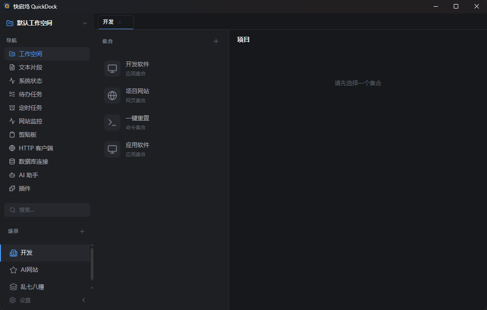

# 快启坞 QuickDock

> 面向 Windows 开发者的效率工具 —— 资源集合、快速启动与工作空间管理

快启坞（QuickDock）是一款专为 Windows 开发者打造的桌面效率工具，融合了 **Raycast 的快速启动** 与 **VS Code 的开发者体验**。它帮助你统一管理工作空间、项目、目录、网页链接、常用命令与应用，并内置剪贴板历史、文本片段（树形笔记）、命令面板、待办（含番茄专注）、定时任务、网站监控、HTTP 客户端、数据库连接、Webhook 通知与 17 个开箱即用插件（含可选的 AI 助手），并原生集成 DeepSeek Harness，让开发工作流更高效。



---

## 目录

- [快启坞 QuickDock](#快启坞-quickdock)
  - [目录](#目录)
  - [功能特性](#功能特性)
    - [📦 工作空间与资源管理](#-工作空间与资源管理)
    - [📋 剪贴板历史](#-剪贴板历史)
    - [🔍 命令面板](#-命令面板)
    - [📝 文本片段（Snippets）](#-文本片段snippets)
    - [✅ 待办任务（Todos）](#-待办任务todos)
    - [⏰ 定时任务（Scheduler）](#-定时任务scheduler)
    - [📡 网站监控（Monitor）](#-网站监控monitor)
    - [🗒️ 快捷笔记](#️-快捷笔记)
    - [🧠 DeepSeek Harness 集成](#deepseek-harness-集成)
    - [🌐 HTTP 客户端](#-http-客户端)
    - [🗄️ 数据库连接](#️-数据库连接)
    - [💬 AI 助手](#-ai-助手)
    - [🔌 插件系统](#-插件系统)
    - [☁️ WebDAV 云同步](#️-webdav-云同步)
    - [📸 快照备份](#-快照备份)
    - [🔧 全局热键（可自定义）](#-全局热键可自定义)
    - [🖥️ 系统命令](#️-系统命令)
  - [快速开始](#快速开始)
    - [系统要求](#系统要求)
    - [下载安装](#下载安装)
    - [首次使用](#首次使用)
  - [开发指南](#开发指南)
    - [前置条件](#前置条件)
    - [常用命令](#常用命令)
    - [数据库](#数据库)
  - [技术栈](#技术栈)
    - [后端](#后端)
    - [前端](#前端)
  - [项目结构](#项目结构)
  - [数据模型](#数据模型)
  - [全局热键](#全局热键)
  - [设计哲学](#设计哲学)
  - [内置插件](#内置插件)
  - [第三方插件开发](#第三方插件开发)
    - [插件目录结构](#插件目录结构)
    - [plugin.json 完整字段](#pluginjson-完整字段)
    - [三种运行时](#三种运行时)
    - [标准 UI 样式（common.css）](#标准-ui-样式commoncss)
    - [前端通信协议（postMessage）](#前端通信协议postmessage)
    - [安装与测试](#安装与测试)
    - [分发与发布](#分发与发布)
  - [插件架构参考](#插件架构参考)
    - [核心源码文件](#核心源码文件)
    - [生命周期](#生命周期)
  - [构建与打包](#构建与打包)
    - [本地构建](#本地构建)
    - [平台支持](#平台支持)
  - [架构亮点](#架构亮点)
  - [许可协议](#许可协议)
  - [致谢](#致谢)

---

## 功能特性

### 📦 工作空间与资源管理

- **工作空间（Workspace）** — 顶级容器，隔离不同项目上下文
- **场景（Scene）** — 工作空间下的视图分组，快速切换关注点，支持标签/图标/颜色
- **集合（Collection）** — 资源的逻辑分组，可按项目或类型归类，支持四种打开策略
- **项目（Item）** — 支持 6 种类型：
  - `directory` — 目录，用系统/终端打开
  - `file` — 文件，用系统默认程序打开
  - `url` — 网页链接，用浏览器打开
  - `command` — 终端命令，在终端中执行
  - `app` — 应用程序路径
  - `quicklink` — 快速链接，带参数的快捷方式

全层级支持拖拽排序、FTS5 全文搜索。

### 📋 剪贴板历史

- 自动监听并记录文本、图片、文件剪贴板内容
- 支持固定、搜索、复制粘贴、批量删除
- 过期自动清理（可配保留天数）
- 浮动窗口，失焦自动隐藏，`` Ctrl+` `` 一键唤出

### 🔍 命令面板

- 全局搜索：工作空间 / 场景 / 集合 / 项目统一搜索
- 快速执行：选中即操作，支持键盘导航、多选批量
- FTS5 全文搜索，URL 智能识别存为项目
- 最近使用 / 最常使用列表
- 浮动窗口，`Ctrl+K` 即时唤出

### 📝 文本片段（Snippets）

- 预定义的常用文本模板，关键词 + 内容 + 分类
- 一键复制或粘贴到当前活动窗口
- 支持 `{date}` / `{time}` / `{username}` / `{clipboard}` 变量替换
- 搜索、快捷笔记自动保存
- 已升级为**树形笔记**：文件夹 + Markdown 文档任意层级组织（见「🗒️ 快捷笔记」）

### ✅ 待办任务（Todos）

- 待办列表 + 看板视图（待办 / 进行中 / 已完成三列）
- 子任务（单层级 checklist）、标签分类
- 重复待办（每日 / 每周 / 每月）、到期定时提醒（系统通知）
- 🍅 番茄专注计时 — 待办页启动专注倒计时，结束时发系统通知 + 可选 Webhook 推送

### ⏰ 定时任务（Scheduler）

- 五种动作类型：打开软件 / 目录 / 网页 / 命令 / HTTP 请求
- 五种调度方式：一次性 / 间隔 / 每天 / 每周 / 每月
- 执行后系统通知，支持手动立即执行

### 📡 网站监控（Monitor）

- 定时探测 HTTP 状态码与响应时间（GET / HEAD / POST）
- SSL 证书到期预警（可自定义提前天数）
- 关键字 / 正则内容匹配检测
- 在线率统计、检测日志、状态翻转通知（桌面 + Webhook：钉钉 / 企微 / 飞书 / Server酱 / PushPlus / Telegram）
- 响应时间趋势图（24h / 7d / 全部）

### 🗒️ 快捷笔记

- 浮动笔记窗口，`Ctrl+Shift+N` 即时唤出
- **树形笔记库** — 文件夹 + Markdown 文档多层级组织，支持搜索 / 重命名 / 删除
- 自动保存（500ms 防抖）；旧快捷笔记自动兼容为根级文档
- 失焦自动隐藏

### 🧠 DeepSeek Harness 集成

内嵌 [DeepSeek Harness](https://github.com/deepseek-ai/dsh) —— 完整的 Agent 编程入口（工具 / 文件 / 终端 / 会话），与轻量 AI 助手互补：

- **一键环境装填** — 自动检测 node / npx / dsh；缺失时下载便携 Node v22（npmmirror 镜像 → nodejs.org 兜底）并安装 `@deepseek-ai/dsh`
- **原生窗口承载** — `node` 直接拉起 `dsh web --no-open`（CREATE_NO_WINDOW 隐藏控制台），固定官方端口 **3080** 与浏览器访问同址：被健康 dsh 占用则直接复用、残留 node 则清理后重绑，仅被无关进程占用才退回随机端口；QuickDock 原生 WebviewWindow 承载
- **后台常驻** — 关窗不停服务：dsh 独立于窗口后台运行（下次点击秒开），真正停止由设置手动或 QuickDock 退出触发
- **实时安装日志** — 下载 / 解压 / npm 安装全程逐行推送 `quickdock:dsh:log`，进度可见
- **插件安装入口** — 设置页可直接安装 DSH 插件（默认 `dshmarket`，支持粘贴完整命令）；复用官方 `~/.dsh` 数据目录（皮肤 / 插件 / 会话）
- **环境净化** — 过滤第三方注入的 `NODE_OPTIONS`（如 WorkBuddy shim），避免污染 dsh 进程

### 🌐 HTTP 客户端

类 Postman 的接口管理与调试工具，内置于左侧导航：

- **多项目隔离** — 按项目组织 API 集合，每个项目拥有独立的环境变量
- **多层级目录** — 项目下可无限嵌套子目录，支持拖拽排序、跨目录拖拽移动（自动修复子树归属）
- **请求管理** — 每个请求保存方法 / URL / 查询参数 / 请求头 / 请求体，支持历史记录
- **Markdown 文档** — 目录内可新建 Markdown 文档，实时预览编辑（`marked` + `DOMPurify`）
- **环境变量** — 项目级环境变量，可在请求中引用，便于多环境切换
- **右键操作** — 项目 / 目录 / 请求 / 文档统一通过右键菜单操作（新建 / 重命名 / 删除），列表无冗余图标
- **CSV 导入导出** — 请求支持复制 / 导出为 CSV

### 🗄️ 数据库连接

内置多数据库管理与查询工具：

- **多数据库支持** — MySQL / Redis / SQLite，连接密码经 DPAPI 加密存储
- **对象浏览** — 左侧树浏览库 / 表 / 字段（MySQL、SQLite），或 DB 索引 / 键（Redis）
- **Redis 多库** — 连接可指定 DB 索引（0–15），左侧树以 `DB N` 区分不同库
- **SQL 查询** — 执行任意 SQL，结果以表格展示，支持 CSV 复制 / 导出
- **内联编辑（Navicat 风格）** — 单表 `SELECT` 且为单列主键时，结果网格可直接修改单元格；底部「确认 / 丢弃 / 刷新」按钮提交或回滚改动。视图 / JOIN / 聚合 / 复合主键 / 无主键结果为只读，并显示具体原因
- **MySQL 默认库兜底** — 连接未指定默认库时自动用 `SELECT DATABASE()` 解析当前库，确保主键检测可用

### 💬 AI 助手

- **多配置档案** — 支持 OpenAI / DeepSeek / Kimi / 通义千问 / Ollama / Azure OpenAI / 自定义兼容接口
- **四种对话模式** — 聊天 / 解释代码 / 翻译 / 总结，模式 prompt 可叠加自定义 System Prompt
- **SSE 流式输出** — 本地 HTTP 流式服务（127.0.0.1:随机端口），token 到达即显示，非传统轮询
- **思考过程折叠** — 模型思考内容（reasoning_content）以 `<details>` 折叠展示，默认收起
- **思考模式开关** — 可在设置页开启/关闭思考过程显示
- **Markdown 渲染** — 使用 `marked` + `DOMPurify` 安全渲染对话内容
- **参数可配** — Temperature / MaxTokens / TopP / FrequencyPenalty / PresencePenalty
- **自定义 System Prompt** — 设置页 textarea，非空时覆盖默认模式提示
- **会话管理** — 多会话 / 标题自动生成 / 重新生成标题 / 清空上下文 / 删除会话
- **Token 用量统计** — 每次对话自动记录 prompt 和 completion token 数，会话列表可见
- **摘要压缩** — 长对话自动压缩历史摘要（3000 token 阈值），保留最近 12 条完整消息
- **API Key 安全存储** — Windows 下 DPAPI 加密，前端不接触密文
- **测试连接** — 一键验证 API Key 和模型是否可用

### 🔌 插件系统

- 17 个开箱即用的内置插件（计算稿纸、JSON 工具箱、JWT 解码、正则提取、Markdown 预览……）
- 支持三种运行时：纯前端（none）、内嵌 JS 引擎（goja）、独立子进程（native）
- 基于 JSON-RPC 2.0 的前端 ↔ 后端通信协议
- 支持运行时安装 / 卸载 / 启用 / 禁用 / 热键绑定
- **在线市场**：插件管理页内置「在线市场」标签，一键浏览并安装官方维护的第三方插件（[quickdock-plugins](https://github.com/parieses/quickdock-plugins)），支持版本检测与升级，拒绝降级
- [开放第三方插件开发](#第三方插件开发)，打包为 ZIP 即可分发

### ☁️ WebDAV 云同步

- 全量 JSON 备份 / 恢复
- 多版本管理
- 任意 WebDAV 服务器（自建 / 第三方）
- 统一「同步后端」分层（`services` → `internal/sync` → `internal/webdav`），未来可无痛接入 Git / 对象存储

### 📸 快照备份

- 一键导出全部数据为 JSON 文件
- 导入恢复，迁移无忧

### 🔧 全局热键（可自定义）

- 所有热键均可在设置页面自定义
- 运行时动态重注册
- 捕获新热键时自动暂停全局监听以避免冲突

### 🖥️ 系统命令

- 锁屏、关机、重启、睡眠、清空回收站

---

## 快速开始

### 系统要求

- **操作系统**：Windows 10 1809+ 或 Windows 11
- **运行时**：WebView2 Runtime（Windows 自动带）
- **磁盘**：~100MB

### 下载安装

1. 从 [Releases](https://github.com/parieses/quickdock/releases) 下载最新版本
2. 解压到任意目录（推荐 `%LOCALAPPDATA%\QuickDock`）
3. 运行 `QuickDock.exe`
4. 任务栏托盘出现 QuickDock 图标即启动成功

### 首次使用

启动后按 `Ctrl+Space` 唤出主窗口，跟随引导页完成初始设置即可开始使用。

---

## 开发指南

### 前置条件

- Go 1.25+
- Node.js 22+
- Wails3 CLI（**版本须与 `go.mod` 中 wails 模块一致**，见下）

```bash
# 安装 Wails3 CLI —— 版本要与 go.mod 里的 github.com/wailsapp/wails/v3 完全一致
# （当前为 alpha2.115；CLI 与模块版本不一致会导致 bindings 生成格式/内容差异）
go install github.com/wailsapp/wails/v3/cmd/wails3@v3.0.0-alpha2.115

# 安装前端依赖
cd frontend && npm install

# 重新生成前端 bindings（新增/修改 Go 绑定后必须执行；-ts 输出 TS，-clean 先清旧文件）
wails3 generate bindings -ts -i -clean
#   等价于：cd frontend && npm run bindings
```

### 常用命令

| 命令 | 说明 |
|------|------|
| `wails3 dev` | 开发模式（前后端热重载） |
| `go build -o quickdock.exe .` | 直接 Go 构建（需先 `npm run build`） |
| `wails3 build` | 生产构建（含前端构建 + 绑定生成） |
| `task build` | 通过 Taskfile 构建 |
| `task run` | 直接运行已构建的应用 |

**注意**：开发版与正式版共用同一 SQLite 数据库与单实例锁，同一时刻一台机器只能运行一个 QuickDock 实例；正式发布仍走 `wails3 build`（生产 tag 注入版本号与图标 / 清单）。

### 数据库

- SQLite 数据库文件：`~/.quickdock/quickdock.db`（WAL + 外键 + 5s busy timeout）
- 剪贴板图片：`~/.quickdock/images/`
- 应用配置：`%APPDATA%/QuickDock/`
- Node / DSH 运行时：便携 Node 与 dsh 安装于 `~/.quickdock/runtime/node`、`~/.quickdock/dsh`，数据与用户 profile 复用 `~/.dsh`

---

## 技术栈

### 后端

| 技术 | 说明 |
|------|------|
| **Go 1.25** | 主语言 |
| **Wails3 v3.0.0-alpha2.115** | 桌面应用框架 |
| **modernc.org/sqlite** | 纯 Go SQLite（无 CGO） |
| **go-sql-driver/mysql + go-redis/v9** | MySQL / Redis 客户端 |
| **golang.org/x/sys** | Windows 系统 API 调用 |
| **dop251/goja** | JavaScript 沙箱（插件执行） |
| **google/uuid** | UUID 生成 |
| **DPAPI** | Windows 数据保护 API（API Key 加密） |

### 前端

| 技术 | 说明 |
|------|------|
| **Vue 3 + TypeScript** | UI 框架 |
| **Vite 8** | 构建工具（Rolldown） |
| **Pinia 3** | 状态管理 |
| **vue-i18n 11** | 国际化（简体中文 / English） |
| **Lucide Vue** | 图标库 |
| **pinyin-pro** | 拼音搜索支持 |
| **marked 18 + DOMPurify** | Markdown 安全渲染 |
| **@floating-ui/vue 2** | 浮层定位（右键菜单 / 划词浮层 / 图表 tooltip，自动防溢出与翻转） |
| **@wailsio/runtime** | Wails 前端运行时绑定 |

---

## 项目结构

```
quickdock/
├── main.go              # 入口：主窗口创建 + 应用配置 + 更新检查
├── windows.go           # 浮动窗口（剪贴板 / 笔记 / 命令面板）+ 单实例锁
├── tray.go              # 托盘菜单与全局热键注册
├── services/            # Wails 服务层（200+ 前端绑定方法）
│   ├── service.go       # AppService 核心
│   ├── lifecycle.go     # 生命周期管理
│   ├── workspace.go     # 工作空间 CRUD
│   ├── scene.go         # 场景 CRUD
│   ├── collection.go    # 集合 CRUD
│   ├── item.go          # 项目 CRUD
│   ├── clipboard.go     # 剪贴板历史
│   ├── clipboard_sys.go # 系统剪贴板操作
│   ├── palette.go       # 命令面板搜索
│   ├── snippet.go       # 文本片段 / 笔记树
│   ├── note.go          # 笔记树服务（文件夹 + Markdown 文档）
│   ├── todo.go          # 待办任务
│   ├── reminder.go      # 待办提醒调度器（10s 轮询）
│   ├── focus.go         # 番茄专注完成通知
│   ├── schedule.go      # 定时任务
│   ├── schedule_runner.go # 定时任务调度引擎
│   ├── monitor.go       # 网站监控
│   ├── monitor_checker.go # 监控探测引擎
│   ├── system.go        # 系统命令（锁屏 / 关机 / 重启 / 睡眠 / 清空回收站）
│   ├── theme.go         # 主题与窗口底色
│   ├── hotkey.go        # 热键配置管理
│   ├── plugin_*.go      # 插件管理（manage / exec / frontend / host / hotkey / install / window）
│   ├── snapshot.go      # 快照备份
│   ├── sync.go          # WebDAV 同步（统一同步后端）
│   ├── app_launcher.go  # 应用启动
│   ├── frecency.go      # 频率排序算法
│   ├── tool.go          # 打开工具管理
│   ├── autostart.go     # 开机自启
│   ├── api_result.go    # 统一 API 返回
│   ├── types.go         # 配置类型定义
│   ├── ai_*.go          # AI 对话核心（ai_config / ai_conversation / ai_stream / ai_chat）
│   ├── httpclient_*.go  # HTTP 客户端（8 文件：项目/目录/请求/环境/发送/文档/历史/类型）
│   ├── database*.go     # 数据库连接与查询（MySQL/Redis/SQLite，conn/query/tree 拆分）
│   ├── webhook_notify.go# 多渠道 Webhook 通知
│   ├── updatemirror.go  # 更新下载镜像回退（ghfast.top 等）
│   ├── update.go        # 软件更新检查与下载（Ed25519 签名）
│   └── dsh/             # 独立包：node_env.go(Node 便携) + dsh_runtime.go(dsh web 进程) + sysattr_*.go
├── internal/
│   ├── db/              # SQLite 数据层
│   │   ├── db.go        # Database 封装 + 安全白名单
│   │   ├── schema.go    # 表结构 + 自动迁移
│   │   ├── ai.go        # ai_conversations / ai_messages CRUD
│   │   ├── workspace.go # 工作空间数据层
│   │   ├── collection.go# 集合数据层
│   │   ├── item.go      # 项目数据层
│   │   ├── clipboard.go # 剪贴板数据层
│   │   ├── snippet.go   # 文本片段数据层
│   │   ├── note_tree.go # 笔记树（snippets 表升级：文件夹 + 文档）
│   │   ├── todo.go      # 待办数据层
│   │   ├── schedule.go  # 定时任务数据层
│   │   ├── monitor.go   # 监控数据层
│   │   ├── http_history.go # HTTP 请求历史数据层
│   │   ├── tool.go      # 打开工具数据层
│   │   ├── plugin.go    # 插件数据层
│   │   ├── plugin_data.go # 插件专属存储
│   │   ├── plugin_log.go  # 插件执行日志
│   │   ├── usage.go     # 使用频率统计
│   │   ├── settings.go  # 设置数据层
│   │   ├── snapshot.go  # 快照数据层
│   │   ├── httpproject.go # HTTP 客户端项目数据层
│   │   ├── httpdoc.go    # HTTP 目录/文档数据层
│   │   ├── httprequest.go # HTTP 请求数据层
│   │   ├── database.go  # 数据库连接数据层
│   │   ├── repository.go# 仓库层
│   │   ├── helpers.go   # 辅助函数
│   │   └── toolexec_*.go # 工具裸名解析（PATH/App Paths/安装目录；_windows/_other）
│   ├── platform/        # 平台 API 封装
│   │   ├── crypto_windows.go # DPAPI 加密（API Key）
│   │   ├── crypto_darwin.go  # macOS 加密兜底
│   │   ├── clipboard.go # 剪贴板读写
│   │   ├── clipboard_listener_*.go # 剪贴板变更监听（隐藏消息窗口 + AddClipboardFormatListener）
│   │   ├── monitor_other.go # 非 Windows 显示器定位占位
│   │   ├── commands.go  # 系统命令
│   │   ├── monitor.go   # 多显示器定位
│   │   ├── hotkey.go    # 全局热键
│   │   ├── apps.go      # 已安装应用扫描
│   │   ├── favicon.go   # URL 图标抓取
│   │   ├── opener.go    # ShellExecute 打开（危险协议拦截）
│   │   ├── itemicon_*.go # 项目图标
│   │   ├── datadir_*.go # 数据目录（生产 / 开发共用）
│   │   └── icon.go      # 图标处理
│   ├── plugin/          # 插件管理器（manifest / manager / rpc / host / installer / window_manager…）
│   ├── sync/            # 统一同步后端（当前实现：WebDAV）
│   └── webdav/          # WebDAV HTTP 客户端
├── frontend/
│   ├── src/
│   │   ├── components/  # 32 个通用 Vue 组件
│   │   │   ├── AIPage.vue         # AI 对话页面
│   │   │   ├── TodoPage.vue       # 待办任务页面（含番茄专注）
│   │   │   ├── SchedulePage.vue   # 定时任务页面
│   │   │   ├── MonitorPage.vue    # 网站监控页面
│   │   │   ├── NotePanel.vue      # 快捷笔记面板
│   │   │   ├── NoteTreeNode.vue   # 笔记树节点
│   │   │   ├── PluginManagerPage.vue # 插件管理页面
│   │   │   ├── DatabasePage.vue   # 数据库连接页面
│   │   │   ├── SettingsDSH.vue    # DeepSeek Harness 设置页
│   │   │   ├── WebhookSettingsModal.vue # Webhook 通知配置
│   │   │   └── ...（更多组件）
│   │   ├── http-client/  # HTTP 客户端模块（页面 / 树 / 表单 / 响应 / 历史 + composables）
│   │   ├── stores/       # Pinia 状态管理
│   │   ├── types/        # TypeScript 类型（含 ai.ts）
│   │   ├── utils/        # 工具函数（api.ts / pluginBridge.ts / calc.ts …）
│   │   ├── i18n/         # 国际化（zh-CN / en-US）
│   │   └── composables/  # 组合式函数（useHttpData / useHttpDrag / useFloatMenu / useFrecency …）
│   └── vite.config.ts
├── plugins/builtin/     # 仅存 common.css/js 骨架（宿主注入兼容用，勿删）
├── plugins/templates/   # 插件开发模板（none / goja / native）
├── build/               # 构建配置
├── docs/                # 设计文档
├── DESIGN.md            # 设计系统规范
├── Taskfile.yml         # 构建任务定义
└── go.mod
```

---

## 数据模型

```
Workspace（工作空间）
  └── Scene（场景）— 标签/类型/图标/颜色
       └── Collection（集合）— 类型/打开策略/关联工具
            └── Item（项目）
                  ├── directory   — 目录
                  ├── file        — 文件
                  ├── url         — 网页链接
                  ├── command     — 终端命令
                  ├── app         — 应用程序
                  └── quicklink   — 快速链接
```

**独立模型：**

| 模型 | 说明 |
|------|------|
| **ClipboardEntry** | 剪贴板条目（文本/图片/文件） |
| **Snippet** | 文本片段 / 笔记树节点（`is_folder` 区分文件夹与 Markdown 文档） |
| **Todo** | 待办任务（子任务、标签、状态、重复） |
| **Schedule** | 定时任务（五种调度、五种动作） |
| **Monitor** | 网站监控（状态码/SSL/内容匹配） |
| **AIConversation** | AI 对话会话（标题、摘要、token 统计） |
| **AIMessage** | AI 消息（角色、内容、思考过程） |
| **HttpProject** | HTTP 客户端项目（名称、环境变量） |
| **HttpFolder** | HTTP 目录（多层级、归属项目） |
| **HttpDoc** | HTTP Markdown 文档（归属目录） |
| **ApiRequest** | HTTP 请求（方法 / URL / 头 / 体 / 归属目录） |
| **DbConnection** | 数据库连接（MySQL / Redis / SQLite，密码加密） |
| **WebhookConfig** | 多渠道通知配置（钉钉 / 企微 / 飞书 / Server酱 / PushPlus / Telegram） |

所有数据库表通过白名单机制防止 SQL 注入。

---

## 全局热键

| 功能 | 默认快捷键 | 说明 |
|------|-----------|------|
| 切换主窗口 | `Ctrl+Space` | 显示 / 隐藏主界面 |
| 剪贴板历史 | `` Ctrl+` ``（反引号） | 显示 / 隐藏剪贴板浮动窗口 |
| 命令面板 | `Ctrl+K` | 显示 / 隐藏命令面板浮动窗口 |
| 快捷笔记 | `Ctrl+Shift+N` | 显示 / 隐藏笔记浮动窗口 |

> 所有热键均可在「设置 > 热键」页面自定义。

---

## 设计哲学

快启坞遵循 **精准暗色极简主义（Precision Dark Minimalism）**：

- **暗色主题为主** — 层次化灰色调，非纯黑，通过明度对比创造深度；支持深色 / 浅色 / 跟随系统切换，插件窗口同步适配
- **强调色 `#4a9eff`** — 仅用于功能性交互元素，不作装饰
- **三面板布局** — 侧边栏(210px) | 集合列表(300px) | 项目列表(flex-1)
- **8px 基准间距** — 4px 递增，从 2px 到 48px
- **系统字体栈** — 无自定义字体，基字大小 13px
- **150ms 过渡** — 少动效，仅状态变化时使用动画
- **键盘优先** — 所有交互均支持键鼠操作
- **Shadow-border 技术** — `box-shadow` 替代 CSS `border`，消除布局偏移
- **4 种色调层次** — `bg-primary(#1a1a1a)` → `bg-secondary(#1e1e1e)` → `bg-tertiary(#242424)` → `bg-active(#2a2a2a)`

详细设计规范请参阅 [DESIGN.md](./DESIGN.md)。

---

## 内置插件

QuickDock 内置 13 个即开即用的开发小工具：

| 插件 | 功能 |
|------|------|
| `calcsheet` | 计算稿纸（表达式计算） |
| `emoji-search` | Emoji 搜索 |
| `formatter` | 代码 / SQL 等格式化 |
| `hosts-manager` | Hosts 文件管理 |
| `json-toolbox` | JSON 工具箱（格式化 / 校验 / 转换） |
| `jwt-decoder` | JWT 解码 |
| `markdown-preview` | Markdown 预览 |
| `port-scanner` | 端口扫描 |
| `qrcode` | 二维码生成 / 识别 |
| `regex-extractor` | 正则提取 |
| `text-encoder` | 文本编码转换 |
| `time-converter` | 时间戳转换 |
| `wifi-manager` | WiFi 管理 |

插件启动时自动从 `plugins/builtin/` 安装至 `~/.quickdock/plugins/`，同时将 `common.css` 和 `common.js` 拷贝到每个插件根目录，确保直接文件访问也能加载共享样式。

---

## 第三方插件开发

QuickDock 提供开放的插件系统，任何人都可以为它开发第三方插件。插件本质上是包含 `plugin.json` 清单文件的一个目录，支持三种运行时模式。

### 插件目录结构

```
my-plugin/
├── plugin.json           # 插件清单（必须）
├── main.js               # Goja 后端脚本（goja 运行时必须）
├── my-plugin.exe         # 原生可执行文件（native 运行时必须）
├── frontend/
│   ├── index.html        # 前端 UI 入口（可选）
│   ├── style.css         # 专属样式（可选）
│   └── app.js            # 专属脚本（可选）
├── icon.svg              # 插件图标（可选，支持 svg/png/ico/jpg）
└── README.md             # 说明文档（推荐）
```

### plugin.json 完整字段

```json
{
  "id": "com.example.myplugin",
  "name": "我的插件",
  "version": "1.0.0",
  "description": "插件功能描述",
  "author": "YourName",
  "icon": "icon.svg",
  "category": "开发者日常",

  "backend": {
    "runtime": "goja",
    "entry": "main.js",
    "args": []
  },

  "frontend": {
    "enabled": true,
    "entry": "frontend/index.html",
    "width": 520,
    "height": 460
  },

  "commands": [
    {
      "id": "hello",
      "title": "Hello World",
      "hotkey": "Ctrl+Shift+H",
      "keywords": ["hello", "hi"],
      "aliases": ["打招呼", "测试"],
      "prefix": "/hello",
      "matchPattern": "^[a-zA-Z]+$"
    }
  ],

  "capabilities": ["command", "frontend"],
  "permissions": {
    "network": false,
    "filesystem": false,
    "clipboard": true
  }
}
```

| 字段 | 说明 |
|------|------|
| `id` | **必须**。反向域名格式，必须包含至少一个点号，如 `com.example.myplugin` |
| `name` | **必须**。插件显示名称 |
| `version` | **必须**。语义化版本号 |
| `backend.runtime` | **必须**。运行模式：`none` / `goja` / `native` |
| `backend.entry` | `none` 之外必须。入口文件路径 |
| `frontend.enabled` | 是否启用前端面板。`true` 时需指定 `entry` |
| `commands` | 注册到命令面板的命令列表 |
| `capabilities` | 能力声明：`command`（支持命令面板）/ `frontend`（有 UI 面板）|
| `permissions` | 权限声明：`network` / `filesystem` / `clipboard`，默认全 `false` |

### 三种运行时

| 运行时 | 适用场景 | 进程模型 | 开发语言 |
|--------|---------|---------|---------|
| `none` | 纯前端工具（计算器、编码转换） | 无后端进程，全部在 iframe 中运行 | HTML + CSS + JS |
| `goja` | 轻量逻辑（数据转换、文本处理） | 同进程内嵌 JS 引擎，零外部依赖 | JavaScript（ES5） |
| `native` | 系统级操作（文件管理、网络请求） | 独立子进程，JSON-RPC stdin/stdout 通信 | Go / Rust / Python 等任意语言 |

---

#### 快速开始：纯前端插件（runtime: none）

适合无需后端能力的工具类插件，如编码转换、正则测试、Markdown 预览等。

**1. 创建项目结构**

```
my-tool/
├── plugin.json
├── frontend/
│   └── index.html
└── icon.svg
```

**2. plugin.json**

```json
{
  "id": "com.example.my-tool",
  "name": "我的工具",
  "version": "1.0.0",
  "description": "一个纯前端小工具",
  "author": "YourName",
  "icon": "icon.svg",
  "category": "开发者日常",
  "backend": { "runtime": "none" },
  "frontend": {
    "enabled": true,
    "entry": "frontend/index.html"
  },
  "capabilities": ["frontend"]
}
```

**3. 前端页面**使用 **common.css** 标准样式类构建 UI：

```html
<!DOCTYPE html>
<html lang="zh-CN">
<head>
  <meta charset="UTF-8">
  <meta name="viewport" content="width=device-width,initial-scale=1.0">
  <link rel="stylesheet" href="../common.css">
</head>
<body>
<div class="p-app">
  <div class="p-toolbar">
    <span class="p-label">我的工具</span>
    <div class="p-spacer"></div>
    <span id="statusLabel" class="p-muted">就绪</span>
  </div>
  <div class="p-body" style="padding:10px;flex-direction:column;gap:8px">
    <input id="input" class="p-input" placeholder="输入内容…">
    <div id="output" class="p-card p-output">等待输入…</div>
  </div>
</div>
<script>
  // 后端通信不是必须的，纯前端可以直接操作 DOM
  document.getElementById('input').addEventListener('input', function() {
    var val = this.value
    document.getElementById('output').textContent = val ? '你输入了: ' + val : '等待输入…'
  })

  // 接收主题和语言传递
  window.addEventListener('message', function(e) {
    if (e.data && e.data.type === 'plugin:init' && e.data.data) {
      if (e.data.data.theme) document.documentElement.setAttribute('data-theme', e.data.data.theme)
      if (e.data.data.locale) document.documentElement.setAttribute('lang', e.data.data.locale)
    }
  })
</script>
</body>
</html>
```

> 完整模板见 `plugins/templates/none/`。

---

#### 快速开始：Goja 插件（runtime: goja）

适合需要轻量后端的插件，内嵌 JavaScript 引擎，无需外部进程。

**1. plugin.json**（如上，`runtime` 设为 `goja`）

**2. 后端 main.js** — 必须导出 `handleInitialize` 和 `handleExecute`：

```javascript
// handleInitialize — 插件启动时调用（可选）
function handleInitialize(params) {
  api.log('插件初始化完成')
  return { status: 'ready', version: '1.0.0' }
}

// handleExecute — 处理命令执行（必须）
function handleExecute(params) {
  var command = params.command || ''
  var input = params.input || {}
  var text = input.text || ''

  switch (command) {
    case 'hello':
      return { text: 'Hello, ' + text + '!', display: 'Hello, ' + text + '!' }
    default:
      return { error: '未知命令: ' + command }
  }
}
```

**可用 Goja API：**

| API | 说明 | 所需权限 |
|-----|------|---------|
| `api.log(msg)` | 写日志到后端 | — |
| `api.readFile(path)` | 读取文件 | `filesystem` |
| `api.writeFile(path, data)` | 写入文件 | `filesystem` |
| `api.httpGet(url)` | HTTP GET 请求 | `network` |
| `api.httpPost(url, body)` | HTTP POST 请求 | `network` |
| `api.db.exec(sql)` | 执行 SQL（插件专属 SQLite 数据库） | — |
| `api.db.query(sql)` | 查询 SQL，返回数组 | — |

**3. 前端与后端通信**：通过 `window.parent.postMessage` 发起 `plugin:execute`：

```javascript
function pluginExec(command, data) {
  return new Promise(function(resolve, reject) {
    var id = Date.now() + '_' + Math.random().toString(36).slice(2, 6)
    var timeout = setTimeout(function() { reject(new Error('响应超时')) }, 10000)

    var handler = function(e) {
      if (e.data && e.data.type === 'plugin:result') {
        window.removeEventListener('message', handler)
        clearTimeout(timeout)
        if (e.data.error) reject(new Error(e.data.error))
        else resolve(e.data.data)
      }
    }
    window.addEventListener('message', handler)
    window.parent.postMessage({ type: 'plugin:execute', id: id, command: command, input: { text: data } }, '*')
  })
}

// 调用后端
pluginExec('hello', 'World').then(function(data) {
  console.log('结果:', data)
})
```

> 完整模板见 `plugins/templates/goja/`。

---

#### 快速开始：原生插件（runtime: native）

适合系统级操作，可以用任意语言编写独立子进程，通过 JSON-RPC 2.0 over stdin/stdout 通信。

**1. plugin.json**（`runtime` 设为 `native`，`entry` 指向可执行文件）

**2. 后端（Go 示例）**

```go
package main

import (
	"bufio"
	"encoding/json"
	"fmt"
	"os"
)

type Request struct {
	JSONRPC string      `json:"jsonrpc"`
	ID      int         `json:"id"`
	Method  string      `json:"method"`
	Params  interface{} `json:"params,omitempty"`
}

type Response struct {
	JSONRPC string      `json:"jsonrpc"`
	ID      int         `json:"id"`
	Result  interface{} `json:"result,omitempty"`
	Error   interface{} `json:"error,omitempty"`
}

func main() {
	scanner := bufio.NewScanner(os.Stdin)
	for scanner.Scan() {
		var req Request
		if err := json.Unmarshal([]byte(scanner.Text()), &req); err != nil {
			continue
		}
		switch req.Method {
		case "initialize":
			fmt.Println(`{"jsonrpc":"2.0","id":` + fmt.Sprint(req.ID) + `,"result":{"status":"ready"}}`)
		case "host.ping":
			fmt.Println(`{"jsonrpc":"2.0","id":` + fmt.Sprint(req.ID) + `,"result":{"pong":true}}`)
		case "plugin.execute":
			fmt.Println(`{"jsonrpc":"2.0","id":` + fmt.Sprint(req.ID) + `,"result":{"text":"Hello from native plugin!","success":true}}`)
		}
	}
}
```

**JSON-RPC 协议：**

| 方向 | 方法 | 说明 |
|------|------|------|
| 宿主→插件 | `initialize` | 插件初始化，返回 `{status: "ready"}` |
| 宿主→插件 | `host.ping` | 健康检查，返回 `{pong: true}`（每 30 秒） |
| 宿主→插件 | `plugin.execute` | 执行命令，`params = {command, input}` |
| 插件→宿主 | `host.shutdown` | 插件请求退出 |

**插件可调用的宿主方法（回调请求）：**

| 方法 | 说明 | 所需权限 |
|------|------|---------|
| `host.clipboard.read` / `write` | 读写剪贴板 | `clipboard` |
| `host.dialog.open` / `save` | 文件对话框 | `filesystem` |
| `http.get` / `http.post` | HTTP 请求 | `network` |
| `db.get` / `db.set` | 插件专属存储 | — |
| `log.info` / `log.error` | 日志 | — |
| `ui.show` / `ui.hide` | 显示/隐藏前端面板 | — |
| `host.notify` | 系统通知 | — |

> 完整原生 Go 模板见 `plugins/templates/native/`，包含完整的请求分发和主机方法调用示例。

---

### 标准 UI 样式（common.css）

所有插件前端自动注入 `common.css`，提供统一的设计语言。插件开发时直接使用以下 CSS 变量和样式类：

**CSS 变量：**

```
--bg-primary: #1a1a1a   --bg-secondary: #1e1e1e   --bg-tertiary: #242424
--text-primary: #e8e8e8  --text-secondary: #aaa    --text-muted: #999
--accent: #4a9eff        --success: #28c864        --danger: #e24b4a
--warning: #f0a030       --radius: 6px             --font: 系统字体栈
--font-mono: 等宽字体     --transition: 0.1s        --border: #2a2a2a
```

**布局类：** `.p-app`（全屏容器）/ `.p-toolbar`（工具栏）/ `.p-body`（内容区）/ `.p-pane`（面板）/ `.p-statusbar`（状态栏）

**按钮类：** `.p-btn` / `.p-btn-primary`（蓝色）/ `.p-btn-sm` / `.p-btn-group`

**表单类：** `.p-input` / `.p-input-mono` / `.p-select` / `.p-textarea`

**列表卡片类：** `.p-list` / `.p-item` / `.p-item-label` / `.p-item-desc` / `.p-card`

**文本类：** `.p-output`（代码输出区）/ `.p-label` / `.p-muted` / `.p-empty` / `.p-error` / `.p-spacer` / `.p-sep`

> 插件会自动适配 QuickDock 的明暗主题：通过 `plugin:init` 和 `plugin:theme` 消息传递 `data-theme` 属性，`common.css` 内置 `html[data-theme="light"]` 浅色适配规则。

---

### 前端通信协议（postMessage）

插件前端页面运行在 iframe 沙箱中，与主应用通过 `postMessage` 通信。

| type | 方向 | 说明 |
|------|------|------|
| `plugin:init` | 主应用→插件 | 初始化通知，携带 `theme`、`locale`、`text`（剪贴板内容） |
| `plugin:theme` | 主应用→插件 | 主题/语言变更通知 |
| `plugin:execute` | 插件→主应用 | 向后端发送执行命令请求 |
| `plugin:result` | 主应用→插件 | 命令执行结果响应 |
| `plugin:pickfile` | 插件→主应用 | 原生文件选择 `{id, title?, filter?, pattern?}` → 回 `plugin:pickfile-result {id, path\|null}` |
| `plugin:readfile` | 插件→主应用 | 读取选中文件 `{id, path}` → 回 `plugin:readfile-result {id, payload\|null}`，`payload={type:'text'\|'dataurl', content}` |

> **推荐直接用宿主注入的桥接 API**（无需手写 postMessage）：`window.qdPickFile(opts?)` 打开原生文件对话框返回路径（取消为 `null`）；`window.qdReadFile(path)` 读取文件内容（文本→`{type:'text',content}`，图片/二进制→`{type:'dataurl',content}`）。选文件务必走 `qdPickFile`——iframe 沙箱内 `<input type=file>` 会触发宿主窗口失焦问题。

**通信示例：**

```javascript
// 插件前端 → 主应用：执行命令
window.parent.postMessage({
  type: 'plugin:execute',
  id: 'req_001',
  command: 'hello',
  input: { text: 'World' }
}, '*')

// 接收结果
window.addEventListener('message', function(e) {
  if (e.data && e.data.type === 'plugin:result') {
    // e.data.id → 请求标识
    // e.data.data → 结果数据
    // e.data.error → 错误信息
  }
  // 初始化（主题/语言）
  if (e.data && e.data.type === 'plugin:init' && e.data.data) {
    if (e.data.data.theme) document.documentElement.setAttribute('data-theme', e.data.data.theme)
    if (e.data.data.locale) document.documentElement.setAttribute('lang', e.data.data.locale)
  }
})
```

---

### 安装与测试

1. **打包插件**：将插件目录打包为 ZIP 文件，文件名不限
2. **安装插件**（三种方式）：
   - **在线市场一键安装（推荐）**：进入 **插件管理** 页面，切到 **在线市场** 标签，自动拉取官方插件列表，点「安装」即可，无需手动下载；已装插件显示「升级」按钮
   - **从文件安装**：点击 **从文件安装**，选择 ZIP 包
   - **拖拽安装**：直接将 ZIP 拖拽到插件管理页面
3. **验证**：安装成功后，插件出现在管理页面列表中，状态应为 `running`
4. **调试**：
   - `none` / 前端部分：使用浏览器 DevTools 调试 iframe
   - `goja`：查看 QuickDock 后端日志
   - `native`：插件 stdout/stderr 会被记录到 QuickDock 日志

### 分发与发布

1. 将插件目录打包为 `{your-plugin-id}.zip`
2. 分发 ZIP 文件，用户安装即可使用
3. （可选）在 GitHub 上发布插件，供社区下载
4. （推荐）提交到官方插件市场 [quickdock-plugins](https://github.com/parieses/quickdock-plugins)，经 CI 自动打包并上线「在线市场」，用户可一键安装 / 升级

> **安全提示**：`permissions` 字段声明了插件的权限需求，用户安装时可见。请按最小权限原则声明，如无需网络功能则不声明 `network`。

---

## 插件架构参考

### 核心源码文件

| 文件 | 作用 |
|------|------|
| `internal/plugin/types.go` | PluginManifest、PluginInfo 等类型定义 |
| `internal/plugin/manifest.go` | plugin.json 加载与校验 |
| `internal/plugin/manager.go` | 插件管理器（加载/卸载/健康检查/重启） |
| `internal/plugin/rpc.go` | JSON-RPC 2.0 通信层 |
| `internal/plugin/host.go` | 宿主方法注册与权限校验 |
| `internal/plugin/installer.go` | ZIP 安装/校验/回滚 |
| `internal/plugin/window_manager.go` | 插件独立窗口管理 |
| `services/plugin.go` | Wails 前端绑定（安装/启用/禁用/卸载/执行） |
| `plugins/templates/` | 三种运行时的完整开发模板 |

### 生命周期

```text
安装 → 加载 plugin.json → 校验字段
     → runtime=none:  就绪，无后端进程
     → runtime=goja:  启动 goja VM，执行 main.js，调用 handleInitialize
     → runtime=native: spawn 子进程，发送 initialize 请求
     → 等待请求 → 处理命令 → 响应
     → 卸载时: 停止进程/VM，清理热键，删除目录
```

- **崩溃自动重启**：native 子进程崩溃后自动重启，最多 3 次（指数退避 2s → 4s → 6s）
- **健康检查**：每 30 秒 ping 一次，连续 3 次无响应标记为 `unresponsive`
- **安全防护**：ZIP 安装时校验路径穿越攻击（Zip Slip），限制解压上限 100MB，单文件上限 50MB

---

## 构建与打包

### 本地构建

```bash
# 开发模式（热重载）
wails3 dev

# 生产构建
wails3 build

# 直接 Go 构建（需先 npm run build）
cd frontend && npm run build
cd .. && CGO_ENABLED=0 go build -o quickdock.exe .

# 运行
./quickdock.exe
```

### 平台支持

> **当前仅支持 Windows 10 1809+/Windows 11**。macOS 适配已做平台层抽象（`mac` 分支），但 `.app` 必须在 Mac 上构建（Wails 依赖 CGO 和 macOS 框架）。

---

## 架构亮点

- **四窗口架构**：主窗口 (1100×700) + 剪贴板 / 笔记浮动窗口 (480×420) + 命令面板浮动窗口 (680×460)，另有 DSH 原生长驻窗口
- **所有次级窗口延迟创建**：在首次热键触发时才创建 WebView2，确保运行时完全初始化，避免白屏
- **WebView2 内存优化**：`--in-process-gpu` + `--renderer-process-limit=4` 等参数限制渲染进程数，任务管理器更清爽
- **窗口即隐藏**：关闭主窗口时隐藏到系统托盘而非退出，通过 `atomic.Bool` 标志区分真实退出
- **多显示器支持**：浮动窗口自动定位到鼠标所在屏幕
- **浮窗位置记忆**：剪贴板 / 命令面板 / 笔记浮窗位置经 kvstore 服务持久化，重启后原位恢复；拔出外接屏后自动收拢回窗口所在屏幕工作区
- **框架原生底座**：托盘 / 全局热键 / 单实例 / 开机自启 / 自动更新 / 系统通知均基于 Wails v3 框架 API；系统日志汇入统一面板（`slog.SetDefault` 桥接）；仅剪贴板富内容、图标提取、系统命令等原理性 Win32 调用保留手写
- **纯 Go SQLite**：使用 modernc.org/sqlite，零 CGO 依赖，简化交叉编译
- **回调注入解耦**：热键函数通过注入方式避免 main 和 services 包之间的循环依赖
- **SQL 白名单**：表名和列名校验防止 SQL 注入
- **本地流式架构**：内置 `127.0.0.1` HTTP SSE 流式服务（随机端口 + 随机 token），避免 Wails 事件框架的缓冲限制，实现逐 token 即时显示（用于 AI 对话等场景）
- **API Key 安全加密**：Windows 下 DPAPI 加密存储（`CryptProtectData`），macOS 下 base64 编码，前端全程不接触密文
- **单实例锁**：框架 `Options.SingleInstance`（UniqueID `QuickDock-Instance`，开发/正式共用）——二次启动自动通知首实例把主窗口带到前台后退出，避免多进程并发写同一 SQLite 库
- **后台服务**：SQLite WAL 模式 + 待办提醒调度器 (10s) + 定时任务调度器 + 监控检查器（含 SSL 检测）+ 流式 HTTP 服务（AI）+ 插件健康检查 + DSH 隐藏进程管理

---

## 许可协议

本项目采用 **MIT License** 开源许可证。

Copyright (c) 2025-2026 王亮亮

```
MIT License

Permission is hereby granted, free of charge, to any person obtaining a copy
of this software and associated documentation files (the "Software"), to deal
in the Software without restriction, including without limitation the rights
to use, copy, modify, merge, publish, distribute, sublicense, and/or sell
copies of the Software, and to permit persons to whom the Software is
furnished to do so, subject to the following conditions:

The above copyright notice and this permission notice shall be included in all
copies or substantial portions of the Software.

THE SOFTWARE IS PROVIDED "AS IS", WITHOUT WARRANTY OF ANY KIND, EXPRESS OR
IMPLIED, INCLUDING BUT NOT LIMITED TO THE WARRANTIES OF MERCHANTABILITY,
FITNESS FOR A PARTICULAR PURPOSE AND NONINFRINGEMENT. IN NO EVENT SHALL THE
AUTHORS OR COPYRIGHT HOLDERS BE LIABLE FOR ANY CLAIM, DAMAGES OR OTHER
LIABILITY, WHETHER IN AN ACTION OF CONTRACT, TORT OR OTHERWISE, ARISING FROM,
OUT OF OR IN CONNECTION WITH THE SOFTWARE OR THE USE OR OTHER DEALINGS IN THE
SOFTWARE.
```

---

## 致谢

- [Wails](https://wails.io/) — 强大的 Go 桌面应用框架
- [Vue.js](https://vuejs.org/) — 渐进式前端框架
- [Floating UI](https://floating-ui.com/) — 浮层定位引擎（防溢出 / 自动翻转）
- [Lucide](https://lucide.dev/) — 优雅的开源图标库
- [modernc.org/sqlite](https://modernc.org/sqlite) — 纯 Go SQLite 实现
- [marked](https://marked.js.org/) — 快速 Markdown 解析
- [DOMPurify](https://github.com/cure53/DOMPurify) — XSS 安全过滤
